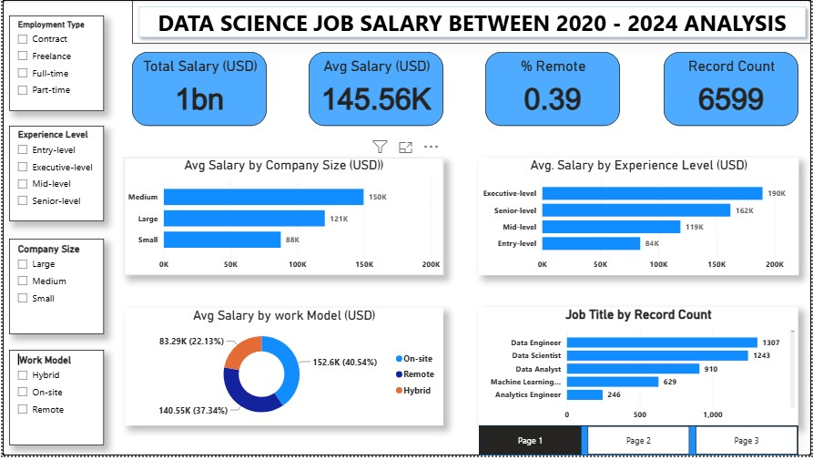
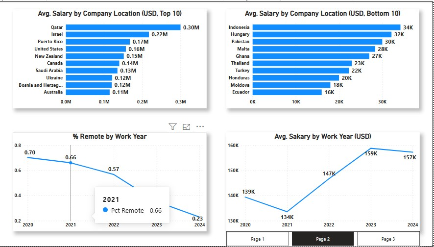

# 💼 Data Science Job Salary Analysis (2020 – 2024)

**Prepared by:** Ubong Solomon

---

## 1. Introduction

The data science job market has expanded rapidly since 2020, spanning multiple roles, experience levels, work models, and countries. Understanding how salaries vary across these dimensions is essential for workforce planning, compensation benchmarking, and hiring strategy. This project analyzes five years (2020–2024) of data science job salary records through an interactive Power BI dashboard, converting raw compensation data into insights that support management decisions on pay structure, remote-work policy, and talent location strategy.

The goal of this report is to summarize the dashboard's findings in a structured format for management review, and to translate the numbers into clear, actionable recommendations.

---

## 2. Data Description

The dataset underlying this dashboard covers data science job salary records from **2020 to 2024**. Each record includes:

| Field | Description |
|---|---|
| Job Title | Role held (e.g., Data Engineer, Data Scientist, Data Analyst, Machine Learning Engineer, Analytics Engineer) |
| Experience Level | Entry-level, Mid-level, Senior-level, Executive-level |
| Employment Type | Contract, Freelance, Full-time, Part-time |
| Company Size | Small, Medium, Large |
| Work Model | On-site, Remote, Hybrid |
| Work Year | Year the salary was recorded (2020–2024) |
| Company Location | Country where the employer is based |
| Employee Residence | Country where the employee resides |
| Salary (USD) | Compensation, standardized in US Dollars |

**Scope:** 6,599 salary records across a 5-year period, filterable by Employment Type, Experience Level, Company Size, and Work Model.

---

## 3. Methodology

The analysis followed these steps:

1. **Data consolidation** – Job title, compensation, location, and work-arrangement records were combined into a single structured table.
2. **Data cleaning** – Records were checked for missing values, inconsistent country/location naming, and salary currency standardization (all converted to USD).
3. **Aggregation** – Salary figures were aggregated by company size, experience level, work model, work year, job title, company location, and employee residence.
4. **Visualization** – Aggregated measures were built into an interactive Power BI dashboard using bar charts, line charts, a donut chart, a pie chart, and KPI cards, with slicers for Employment Type, Experience Level, Company Size, and Work Model.
5. **Interpretation** – Patterns in the visualized data were reviewed to surface trends, pay gaps, and areas warranting management attention.

**Tool used:** Power BI Desktop

---

## 4. Analysis and Findings  

### 4.1 Overall Performance (2020–2024)

| Metric | Value |
|---|---|
| Total Salary (USD) | **1bn** |
| Average Salary (USD) | **145.56K** |
| % Remote | **39%** |
| Record Count | **6,599** |

### 4.2 Average Salary by Experience Level
- Entry-level: **84K**
- Mid-level: **119K**
- Senior-level: **162K**
- Executive-level: **190K**

Salary scales consistently with seniority, with a **126K gap** between entry-level and executive-level pay.

### 4.3 Average Salary by Company Size
- Small: **88K**
- Large: **121K**
- Medium: **150K** (highest)

Medium-sized companies pay the highest average salary, ahead of large companies.

### 4.4 Average Salary by Work Model
- Hybrid: **83.29K (22.13% of records)**
- Remote: **140.55K (37.34% of records)**
- On-site: **152.6K (40.54% of records)**

On-site roles command the highest average pay, while hybrid roles are both the least common and the lowest paid.

### 4.5 % Remote Work by Year 
- 2020: **70%**
- 2021: **66%**
- 2022: **57%**
- 2024: **23%**

Remote work has declined sharply and steadily since 2020, dropping by roughly 47 percentage points over the period.

### 4.6 Average Salary by Work Year
- 2020: **139K**
- 2021: **134K** (low point)
- 2022: **147K**
- 2023: **159K** (peak)
- 2024: **157K**

Average salary dipped in 2021 before climbing to a peak in 2023 and holding steady into 2024.

### 4.7 Job Title by Record Count
- Data Engineer: **1,307**
- Data Scientist: **1,243**
- Data Analyst: **910**
- Machine Learning Engineer: **629**
- Analytics Engineer: **246**

Data Engineer and Data Scientist roles dominate the dataset, together accounting for nearly 40% of all records.

### 4.8 Total Salary by Job Title
- Data Scientist: **264M (31.76%)**
- Data Engineer: **201M (24.15%)**
- Machine Learning Engineer: **119M (14.35%)**
- Data Analyst: **101M (12.21%)**
- Analytics Engineer: **38M (4.55%)**
- Remaining roles (ML Engineer, Research Scientist, Data Science Manager): **~13%** combined

Data Scientists claim the largest share of total salary spend, even though Data Engineers have more records — indicating higher average pay per Data Scientist role.

### 4.9 Average Salary by Company Location
**Top 10:** Qatar (0.30M), Israel (0.22M), Puerto Rico (0.17M), United States (0.16M), New Zealand (0.15M), Canada (0.14M), Saudi Arabia (0.13M), Ukraine (0.12M), Bosnia and Herzegovina (0.12M), Australia (0.11M)

**Bottom 10:** Indonesia (34K), Hungary (32K), Pakistan (30K), Malta (28K), Ghana (27K), Thailand (23K), Turkey (22K), Honduras (20K), Moldova (18K), Ecuador (16K)

The gap between the highest-paying company location (Qatar, 0.30M) and the lowest (Ecuador, 16K) is nearly **19x**.

### 4.10 Average Salary by Employee Residence
Top residences by average salary: Israel (0.42M), Qatar (0.30M), Malaysia (0.20M), Puerto Rico (0.17M), United States (0.16M), New Zealand (0.15M), Canada (0.14M), Saudi Arabia (0.13M), China (0.13M), Bosnia and Herzegovina (0.12M).

Notably, **Israel ranks higher by employee residence (0.42M) than by company location (0.22M)** — suggesting Israeli-based employees often earn more than the average paid by companies located in Israel, likely due to remote work for higher-paying foreign employers.

---

## 5. Key Insight

- **Remote work is in structural decline.** The share of remote roles fell from 70% in 2020 to 23% in 2024 — a sustained, multi-year trend rather than a temporary fluctuation.
- **On-site roles now pay the most, and hybrid roles pay the least.** This reverses the "remote work commands a premium" assumption often seen earlier in the market.
- **Compensation is highly seniority-driven.** Executive-level pay (190K) is more than double entry-level pay (84K).
- **Medium-sized companies, not large ones, pay the most on average** — worth noting for talent-acquisition strategy.
- **Pay is heavily geography-dependent**, with almost a 19x gap between the highest- and lowest-paying company locations.
- **Data Scientists capture the largest share of total salary spend (31.76%)**, even though Data Engineers have the most records — indicating a higher average salary per Data Scientist.

---

## 6. Recommendation

1. **Reassess remote/hybrid compensation policy** in light of the shift toward on-site work — determine whether hybrid roles are underpaid relative to market demand or reflect a genuine shift in role value.
2. **Benchmark pay by company size**, not just headcount growth — investigate why medium-sized companies out-pay large ones, and ensure large-company offers remain competitive for senior talent.
3. **Use geography strategically in hiring** — the wide pay gap across company locations suggests opportunities for cost-effective hiring in lower-paying regions without necessarily sacrificing talent quality, balanced against retention risk.
4. **Prioritize retention planning for Data Scientists and Data Engineers**, who together account for the majority of both headcount and total salary spend.
5. **Monitor the 2021 salary dip and 2023 peak** to understand what market or organizational factors drove the swing, and plan compensation budgets accordingly for 2025.

---

## 7. Conclusion

Between 2020 and 2024, 6,599 data science job salary records totaling $1bn in compensation were analyzed, with an average salary of $145.56K. The data reveals a data science labor market moving away from remote work and toward on-site arrangements, with pay rising consistently by seniority and varying dramatically by geography. Data Scientists and Data Engineers dominate both headcount and total compensation spend, and medium-sized companies — not large ones — offer the highest average pay. These findings point to clear areas for management action: revisiting remote/hybrid compensation strategy, benchmarking pay across company sizes, and using geographic and role-based insights to guide hiring and retention priorities going forward.

---

**Prepared by:** Ubong Solomon
